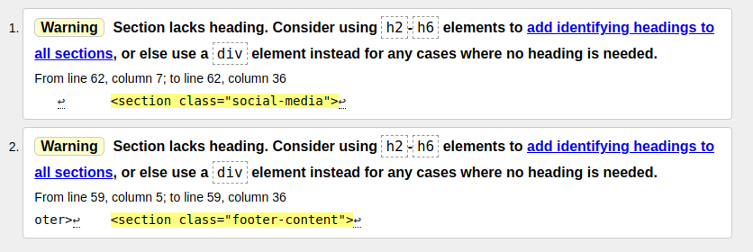
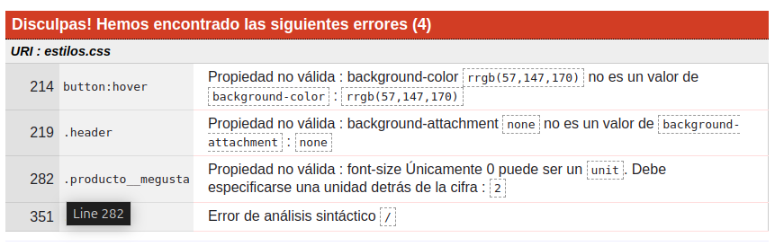
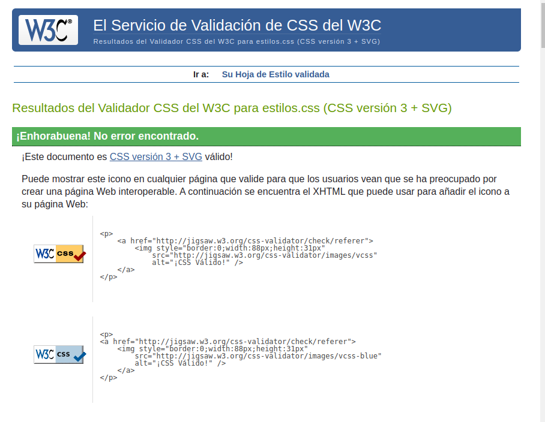

## Proyecto: “Desarrollo de una Aplicación Web Completa con HTML5 y CSS3”
- **ID de la Actividad:** Proyecto 1
- **Módulo:** `LMSGI`
- **Alumno:** 
  - **Nombre y Apellidos:** Daniel Villar Guttenberger
  - **Correo electrónico:** dvilgut2404@g.educaand.es
  - **Iniciales del Alumno:** DVG

# Desarrollo de una Aplicación Web Completa con HTML5 y CSS3

## Descripción del Proyecto
El proyecto consiste en el desarrollo de una aplicación web completa utilizando HTML5 y CSS3, donde el alumnado deberá aplicar conocimientos avanzados de lenguajes de marcas para la creación de documentos web. Se enfocará en una estructura de varias páginas con diseño responsive, siguiendo estándares actuales. Además, se realizará un wireframe previo utilizando Balsamiq para planificar la estructura y el contenido de la aplicación.

## Fase 1: Planificación del Proyecto (Wireframe y Estructura HTML)
Objetivo: Planificar la estructura y diseño de su aplicación web antes de empezar a desarrollarla. Realizar un esquema detallado del contenido y diseño a implementar utilizando Balsamiq para el wireframe.

#### Análisis de requisitos y objetivos del proyecto

Que informacion va a contener:

Objetivos de la Aplicación Web
Proveer una plataforma interactiva donde los usuarios puedan ver mis gustos, musicales, videojuegos y de humor.
Mostrar información dinámica en una interfaz amigable, permitiendo al usuario navegar de forma sencilla y eficiente.

- Contenido que la Aplicación Va a Contener:

**Página de inicio/Biografia:**

Presentar la personalidad del creador de contenido de una manera visualmente atractiva, generando interés en los usuarios para explorar más.

**Página de videojuegos:**

Mostrar los videojuegos favoritos del creador y proporcionar una plataforma para que los usuarios descubran nuevos juegos y puedan acceder a la pagina oficial de estos.

**Página de clips**

Proveer contenido entretenido en forma de clips que mantengan a los usuarios involucrados y aumenten el tiempo que pasan en la plataforma

**Pagina de musica**

Mostrar la música preferida por el creador, y ofrecer a los usuarios una forma de descubrir música nueva basada en sus gustos.

**Pagina de memes**

Proporcionar entretenimiento de forma ligera y divertida, permitiendo a los usuarios disfrutar de memes y compartirlos.

**Pagina de visualizador de memes:**

Que los usuarios puedan comentar los memes que mas les hayan gustado de la pagina anterior y puedan darle like.

**Pagina de Preguntas**

Crear una interacción directa con los usuarios, donde puedan conocer mejor al creador y tener una experiencia personalizada

**Wireframe (Balsamiq)**

El wireframe será diseñado utilizando Balsamiq para representar visualmente cómo se verá la interfaz de usuario. Se incluirán:

- Página de inicio en la que aparece la biografia con la barra de navegación y elementos clave.
- Página de los videojuegos favoritos en los que aparecen una pequeña descripcion de estos y enlaces a las paginas oficiales
- Página de clips en la que apareceran los clips destacados de mis juegos
- Pagina de musica en la que se veran mis canciones favoritas y un reproductor de las mismas
- Pagina de memes en la que se veran fotos de memes que me gustan
- Pagina de meme visualicer, cuando clickes en cada imagen aparecera esta pagina en la que se vera la imagen con una caja de comentarios y un voton para dar like
- Pagina preguntas, en la que el usuario tendra un formulario en el que podria enviarme preguntas con su correo para que pueda responderles


### Estructura HTML planificada

Las etiquetas semánticas son cruciales para mejorar la accesibilidad y la comprensión del contenido por parte de los motores de búsqueda. A continuación se justifica el uso de algunas de las etiquetas semánticas clave:

- **`<header>`**:
  - Define el encabezado del sitio.
  - Proporciona una estructura clara.
  - Mejora la accesibilidad.

- **`<nav>`**:
  - Indica que la sección contiene enlaces de navegación.
  - Facilita la búsqueda de información.
  - Mejora la accesibilidad.

- **`<main>`**:
  - Especifica el contenido principal del documento.
  - Destaca las secciones más importantes de la página.

- **`<section>`**:
  - Ayuda a dividir el contenido en bloques temáticos.
  - Mejora la organización.
  - Facilita el SEO.

- **`<footer>`**:
  - Representa la parte final del documento.
  - Incluye la información del autor y enlaces adicionales.

- **`<head>`**:
  - Contiene metadatos sobre el documento, como el título, la codificación de caracteres y enlaces a archivos externos (CSS, JavaScript).
  - No es visible para el usuario pero es esencial para el funcionamiento correcto del sitio.

- **`<body>`**:
  - Define el contenido visible de la página web.
  - Contiene todos los elementos que el usuario puede ver y con los que puede interactuar.

- **``**:
  - Se utiliza para insertar imágenes en la página.
  - La propiedad `alt` mejora la accesibilidad proporcionando una descripción textual de la imagen para usuarios con discapacidades visuales.

- **`<a>`**:
  - Define un enlace en la página web.
  - Permite la navegación entre diferentes páginas o recursos externos.
  - El atributo `href` especifica la URL de destino del enlace.

#### Beneficios

El uso de estas etiquetas semánticas:
- Mejora la estructura de la página.
- Facilita la comprensión tanto para los usuarios como para los motores de búsqueda.
- Hace que los sitios web sean más accesibles para personas con discapacidades.

## Fase 2: Diseño y Desarrollo del Frontend (HTML y CSS)

Aqui se ve la primera pagina de las 7 de HTML que he desarrollado y la parte correpondiente del CSS, el resto se pueden ver en cada uno de los archivos que hay en la carpeta. 

```
<!DOCTYPE html>
<html lang="es">
<head>
  <meta charset="UTF-8">
  <meta name="viewport" content="width=device-width, initial-scale=1.0">
  <title>Mi Proyecto Web</title>
  <link rel="stylesheet" href="css/estilos.css">
</head>
<body>

  <header>
    <a href="biografia.html">
      
    </a>
    <nav>
      <button class="menu-toggle" aria-label="Abrir menú">
        &#9776; 
      </button>
      <ul class="menu">
        <li><a href="biografia.html">Biografia</a></li>
        <li><a href="videojuegos.html">Videojuegos</a></li>
        <li><a href="clips.html">Clips</a></li>
        <li><a href="musica.html">Musica</a></li>
        <li><a href="memes.html">Memes</a></li>
        <li><a href="preguntame.html">Preguntame</a></li>
      </ul>
    </nav>
  </header>

  <main>

    <section class="bienvenida">
      <h1>Bienvenido a Nuestro Sitio Web</h1>
      <p>Explora mi pagina y aprende sobre mi historia y gustos. Aquí podrás descubrir lo que me motiva en áreas como videojuegos, memes, música.</p>
    </section>


    <section class="dondeVivo">
      <h1>Mi Pueblo</h1>
      <p>San Fernando es una ciudad situada en la provincia de Cádiz, en Andalucía, España, conocida por su rica historia y su relación con la Armada Española. Se encuentra cerca de la bahía de Cádiz, lo que le da un atractivo marítimo con playas como la de Camposoto. Su patrimonio incluye monumentos como la Iglesia Mayor de San Pedro y el Castillo de San Romualdo. San Fernando también es famosa por su gastronomía, especialmente el pescado y marisco, y sus fiestas, como el Carnaval y la Semana Santa.</p>
      <iframe src="https://www.google.com/maps/embed?pb=!1m18!1m12!1m3!1d25669.889265064703!2d-6.222135759423982!3d36.46393199422833!2m3!1f0!2f0!3f0!3m2!1i1024!2i768!4f13.1!3m3!1m2!1s0xd0dcd24afe80747%3A0xeaa0fa57425c3a0a!2s11100%20San%20Fernando%2C%20C%C3%A1diz!5e0!3m2!1ses!2ses!4v1733074795850!5m2!1ses!2ses" width="600" height="450" style="border:0;" allowfullscreen="" loading="lazy" referrerpolicy="no-referrer-when-downgrade"></iframe>
    </section>

    <section class="biografia">
      <h2>Mi Historia</h2>
      <p>Mi nombre es Dani y soy una persona apasionada por la tecnología, los videojuegos, la música y los memes. Desde pequeño, me encantó explorar nuevos mundos virtuales y aprender sobre la cultura digital. Con el tiempo, me he convertido en un creador de contenido y estoy muy emocionado de compartir mi vida y mis intereses con ustedes.</p>

      <p>A lo largo de los años, he aprendido muchas lecciones valiosas y he desarrollado una gran variedad de habilidades. Mi pasión por los videojuegos me ha llevado a estudiar la industria, y ahora soy un experto en el análisis y la creación de contenido relacionado con juegos. Mi amor por la música y los memes también ha sido una parte fundamental de mi vida, y a través de este proyecto web, quiero compartir mis conocimientos y experiencias con todos ustedes.</p>

      <h3>¿Qué hago?</h3>
      <p>A través de esta página, podrás encontrar una variedad de contenido relacionado con mis intereses. Desde análisis de juegos hasta música y memes que creo que les gustarán, este es un espacio para explorar y disfrutar de lo que más me apasiona.</p>
    </section>

  </main>

  <footer>
    <section class="footer-content">
      <p>Desarrollado por danygutt</p>
      
      <section class="social-media">
        <a href="https://www.facebook.com" target="_blank">
          
        </a>
        <a href="https://www.twitter.com" target="_blank">
          
        </a>
        <a href="https://www.instagram.com" target="_blank">
          
        </a>
      </section>
    </section>
  </footer>
  <script src="js/script.js"></script>
</body>
</html>
```

Y este seria la parte ce CSS: 

```

/* Selector universal */
*{
  box-sizing: border-box;
  padding: 0;
  margin: 0;
  font-family: monospace;
}

/* estilos.css */


/* Estilo para el encabezado */


main {
  margin-top: 40px; 
  padding-bottom: 200px;
  background-color: #f4f4f4;
}

body {
  font-family: Arial, sans-serif;
  margin: 0;
  padding: 0;
  background-color: #f4f4f4;
  color: #333; 
  line-height: 1.6;
}

a img{
  width: 4rem;
  margin-right: 1rem;
}

header {
  display: flex;
  align-items: center;  
  justify-content: flex-start;  
  background-color: rgb(57, 147, 170);
  color: white;
  padding: 0.625rem 1rem;
}

nav {
  margin-left: 1rem;  
}


nav ul {
  list-style-type: none;
  padding-left: 0;
  display: flex; 
  margin: 0;
  gap: 20px;
}

nav ul li {
  margin: 0 1rem;
}
nav ul li a {
  text-decoration: none;
  color: white; 
  font-size: 1.2rem;
  transition: color 0.3s ease;
}
nav ul li a:hover {
  color: #050505; 
}


footer {
  text-align: center;
  padding: 0rem;
  background-color: rgb(57, 147, 170);
  color: white;
  bottom: 0;
  position: fixed;
  width: 100%;
}

h1, h2 {
  font-size: 1.5rem; 
  color:rgb(57, 147, 170);

}

section {
  padding: 1.25rem; 
}
```

Aqui le enseño la parte del menu y el responsive que se encarga de convertirlos en "hamburguesa" :

```
/*----- menu responsive -------*/

nav .menu {
  display: flex;
  justify-content: center;
  list-style: none;
}

nav .menu li {
  margin: 0 15px;
}

nav .menu li a {
  color: white;
  text-decoration: none;
}

nav .menu-toggle {
  display: none; 
  background-color: transparent;
  border: none;
  color: white;
  font-size: 30px;
  position: absolute;
  top: 10px;
  right: 20px;
  cursor: pointer;
}

/* Estilos responsivos para pantallas pequeñas */
@media (max-width: 768px) {
  nav .menu {
    display: none; 
    flex-direction: column;
    align-items: center;
    width: 100%;
    background-color: rgb(57, 147, 170);
    position: absolute;
    top: 50px;
    left: 0;
    right: 0;
    padding: 20px;
  }

  nav .menu li {
    margin: 10px 0;
  }

  nav .menu-toggle {
    display: block;
  }

  nav .menu.show {
    display: flex; 
  }
}
```

Aunque para que este funcionara tuve que utilizar js(este es lo unico que he implementado con Java Script):

```
const menuToggle = document.querySelector('.menu-toggle');
const menu = document.querySelector('.menu');

menuToggle.addEventListener('click', () => {
  menu.classList.toggle('show');
});
```

## Fase 3: Implementación y Validación del Código

Objetivo: Revisad y validar su código HTML y CSS, asegurándose de que cumple con los estándares de calidad y accesibilidad web.

Entre algunos de los problemas que encontre en la validacion de mi codigo estuvo este: 



para implementar el cambio pase de tener esto en el footer, html:

```
      <p>Desarrollado por danygutt</p>

```

a esto:

```
      <h2>Desarrollado por danygutt</h2>

```
y tuve que añadirle el estilo en ccs:

```
footer .footer-content h2 {
  color: #fff;
  font-size: 1rem;
  font-family: monospace;
}
```

Mas errores en el CSS:




Una vez cambiados todos los errores nos sale esto:




## Fase 4: Presentación del Proyecto (Videotutorial)

Objetivo: Que los estudiantes presenten su trabajo, explicando sus decisiones de diseño y desarrollo, y demostrando que han seguido las buenas prácticas de validación.